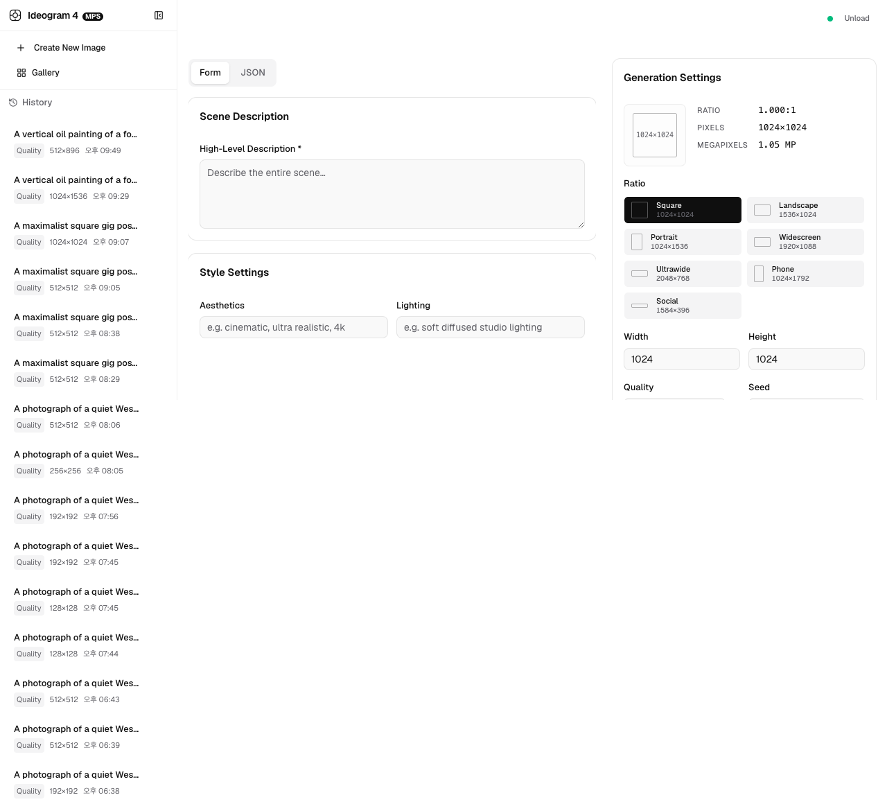

# Ideogram 4 on Apple Silicon (MPS)

Run [Ideogram 4](https://huggingface.co/ideogram-ai/ideogram-4-fp8) on a MacBook
with MPS — no CUDA, no NVIDIA GPU needed.

FP8 weights are dequantized to bf16 on CPU, then the full model is loaded onto
MPS. Three non-obvious tricks make this work: a monkey-patch around MPS's missing
`ndtri` op, manual fp8→bf16 dequant that avoids bitsandbytes entirely, and
loading the Qwen3-VL text encoder without its vision components.

A **WebUI** (FastAPI + React + SQLite) is included for interactive use with
structured prompt composition, generation progress tracking, image history, and
prompt history.

## Quick start

### CLI (single image)

```bash
# 1. Create venv and install deps
python3 -m venv .venv && source .venv/bin/activate
pip install git+https://github.com/ideogram-oss/ideogram4.git
pip install -r server/requirements.txt

# 2. Log in and accept the gated repo terms at
#    https://huggingface.co/ideogram-ai/ideogram-4-fp8
hf auth login

# 3. Generate
python ideogram4_mps.py \
  --prompt-file examples/caption.json \
  --resolution 1024 \
  --preset V4_QUALITY_48 \
  --out result.png
```

### WebUI (full stack)

```bash
# 1. Create venv and install Python deps
python3 -m venv .venv && source .venv/bin/activate
pip install git+https://github.com/ideogram-oss/ideogram4.git
pip install -r server/requirements.txt

# 2. Install Node deps
cd webui && pnpm install && cd ..

# 3. Log in to HuggingFace
hf auth login

# 4. Launch daemon + server + webui
./run.sh
```

Then open http://localhost:5173.

> **Note:** `ideogram4` is not published on PyPI. `pip install git+...` pulls it
> directly from the [official GitHub repo](https://github.com/ideogram-oss/ideogram4).
> `huggingface-cli login` is deprecated — use `hf auth login` instead.

## Architecture

```
Browser (localhost:5173)
    │
    │ HTTP (Vite dev proxy /api → localhost:8000)
    ▼
FastAPI Server (server/main.py, port 8000)
    │  REST API: model control, generation, images, prompts, form state
    │  SQLite persistence via server/db.py
    │
    │ HTTP (httpx)
    ▼
Model Daemon (server/model_daemon.py, port 8001)
    │  Owns the Ideogram4Pipeline in memory. Survives API server restarts.
    │  ThreadingHTTPServer, async generation with progress tracking.
    │
    ▼
Ideogram 4 Pipeline (FP8 → bf16 on CPU → MPS)
       ideogram-4-fp8 weights from HuggingFace
       Qwen3-VL text encoder (text-only, no vision components)
       Conditional + Unconditional transformers (9.3B params each)
       VAE autoencoder
```

### Key ports

| Port | Process | Role |
|------|---------|------|
| 8001 | `model_daemon.py` | Model owner (pipeline in memory) |
| 8000 | `main.py` | FastAPI server, proxy to daemon, SQLite |
| 5173 | Vite dev server | React WebUI with proxy to :8000 |

### Startup flow (`./run.sh`)

1. Installs Python + Node dependencies
2. Kills any existing processes on ports 8000 / 8001 / 5173
3. Starts daemon (port 8001), server (port 8000), webui (port 5173) in parallel
4. Cleans up all processes on SIGINT / SIGTERM / EXIT

### Manual startup (for debugging)

```bash
# Terminal 1: Daemon
python server/model_daemon.py

# Terminal 2: API Server
python server/main.py

# Terminal 3: WebUI
cd webui && pnpm dev
```



## WebUI features

- **Model Panel** — Load / Unload controls with live status indicator (idle / loading / loaded)
- **Caption Editor** — Tabbed interface: structured form (scene, style, composition) or raw JSON
- **Style Settings** — Aesthetics, lighting, medium (photograph / illustration / 3d_render / painting / graphic_design), camera or art style, color palette
- **Composition** — Background description + dynamic element list (type: obj/text, bbox, description)
- **Generation Settings** — 10 aspect ratio presets with visual preview, custom width/height (128–2048px, snapped to 128), quality preset (Turbo / Default / Quality), seed, estimated generation time
- **Status Overlay** — Progress bar with percentage during generation, error state with dismiss
- **Result Gallery** — Horizontal thumbnails with HLD overlay, lightbox full-size preview
- **Prompt History** — Sidebar listing saved prompts, click to restore, delete per entry
- **Auto-save** — Form state persisted via server API (SQLite) with localStorage fallback

Full WebUI spec: [`docs/WEBUI_SPEC.md`](docs/WEBUI_SPEC.md) (Korean)

## CLI options

| Flag | Default | Description |
|------|---------|-------------|
| `--prompt` | — | JSON caption string (inline) |
| `--prompt-file` | — | File containing JSON caption |
| `--repo` | `ideogram-ai/ideogram-4-fp8` | HuggingFace repo ID |
| `--width` | — | Output width, multiple of 16 (overrides `--resolution`) |
| `--height` | — | Output height, multiple of 16 (overrides `--resolution`) |
| `--resolution` | `1024` | Square output (multiple of 16). Ignored if `--width`/`--height` set |
| `--preset` | `V4_QUALITY_48` | `V4_QUALITY_48` / `V4_DEFAULT_20` / `V4_TURBO_12` |
| `--seed` | `20260608` | Random seed |
| `--out` | **required** | Output PNG path |

## JSON caption format

Ideogram 4 needs structured JSON captions. See `examples/caption.json` for a
complete example. Minimal example:

```json
{
  "compositional_deconstruction": {
    "background": "Seoul alleyway at dusk, warm neon signs, wet pavement",
    "elements": [
      {"type": "obj", "desc": "A young Korean woman holding a sign"},
      {"type": "text", "desc": "The sign reads '사랑합니다' in clean Hangul"}
    ]
  }
}
```

Full format reference: https://github.com/ideogram-oss/ideogram4/blob/main/docs/prompting.md

## API endpoints

| Method | Path | Description |
|--------|------|-------------|
| `GET` | `/api/model/status` | Model daemon state (`idle` / `loading` / `loaded`) |
| `POST` | `/api/model/load` | Trigger model load (daemon persists across server restarts) |
| `POST` | `/api/model/unload` | Unload model from memory |
| `POST` | `/api/generate` | Submit generation task (JSON caption + params) |
| `GET` | `/api/status/{task_id}` | Poll generation progress and result |
| `POST` | `/api/verify` | Validate a JSON caption without generating |
| `GET` | `/api/images` | List generated images |
| `DELETE` | `/api/images/{id}` | Delete a generated image |
| `GET` | `/api/prompts` | List saved prompts |
| `DELETE` | `/api/prompts/{id}` | Delete a saved prompt |
| `GET` | `/api/form` | Load last saved form state |
| `POST` | `/api/form` | Save form state |

## Memory & speed

1024×1024, V4_QUALITY_48 on an Apple M5 Max with 128 GB unified memory:

- **Disk**: ~26 GB model weights (FP8 safetensors)
- **Pipeline load**: ~140 s (Qwen3-VL 8B text encoder → MPS transfer is the bottleneck)
- **Generation**: ~402 s
- **Peak memory**: ~50 GB (bf16 model weights + activations)
- **Total model params**: ~26.8B (2× 9.3B transformers + 8B text encoder + VAE)

Smaller presets and resolutions reduce both time and memory proportionally.

## Logging

All processes write structured runtime logs to `logs/` (gitignored):

| Process | Log file pattern | Content |
|---------|-----------------|---------|
| CLI (`ideogram4_mps.py`) | `logs/ideogram4_mps-<ts>.log` | Download, dequant, loading, generation, output |
| Daemon (`model_daemon.py`) | `logs/daemon-<ts>.log` | Model lifecycle, generation tasks, errors |
| Server (`main.py`) | `logs/server-<ts>.log` | HTTP requests, API calls, daemon proxy, uvicorn |

Logs include timestamps, severity level, and structured messages. Set
`IDEOGRAM4_LOG_DIR` to override the default `logs/` directory.

The `.log` suffix from generation metadata (`result.log`) is kept in git via
`.gitignore` exclusion while runtime logs are ignored.

## Requirements

- Apple Silicon Mac (M1/M2/M3/M4/M5)
- Python 3.11+ with pip
- Node.js 20+ with pnpm
- `PYTORCH_ENABLE_MPS_FALLBACK=1` (set automatically)
- ~50 GB unified memory for 1024×1024 V4_QUALITY_48 (smaller resolutions / presets may work with less)
- ~26 GB free disk space for FP8 model weights
- HuggingFace account with access to the gated repo `ideogram-ai/ideogram-4-fp8`

## Example output

<table>
  <tr>
    <td align="center"><br/><sub>한복 여인, 새벽 정원<br/>(V4_QUALITY_48, 1024×1024)</sub></td>
    <td align="center"><br/><sub>황혼 녘 한옥마을<br/>(V4_QUALITY_48, 1024×1024)</sub></td>
    <td align="center"><br/><sub>전통 문양 일러스트<br/>(V4_QUALITY_48, 832×1248)</sub></td>
  </tr>
</table>

## License

This project is MIT. The Ideogram 4 model weights are under the
[Ideogram 4 Non-Commercial License](https://huggingface.co/ideogram-ai/ideogram-4-fp8/blob/main/LICENSE.md).
